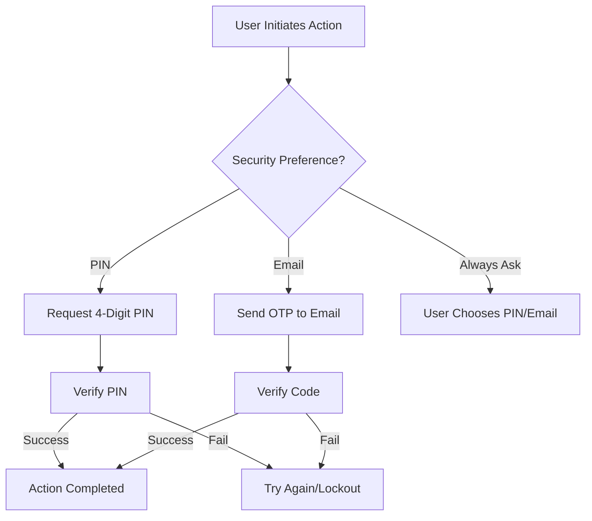

# Pinellas Credit Union - Digital Banking Platform


Welcome to the **Pinellas Credit Union Digital Banking Platform**. This is a highly customized, secure, and modern banking application built on the Laravel framework. This document provides everything you need to know to install, manage, and scale the application.

---

## 📑 Table of Contents
1. [🌟 Project Overview](#-project-overview)
2. [🚀 Key Features](#-key-features)
3. [🛠 Technical Requirements](#-technical-requirements)
4. [📥 Installation Guide](#-installation-guide)
5. [🚀 Deployment & Version Control](#-deployment--version-control)
6. [🗄 Database Management](#-database-management)
7. [🔧 Custom Tools](#-custom-tools)
8. [🛡 Security Gate (MFA)](#-security-gate-mfa)
9. [📊 Troubleshooting](#-troubleshooting)

---

## 🌟 Project Overview
The Pinellas FCU Digital Banking suite is designed to provide members with a seamless financial experience. It features a fully responsive frontend modeled after modern credit union aesthetics (Banno/Jack Henry style), a robust Administrative backend, and advanced security protocols.

---

## 🚀 Key Features

| Feature | Description |
| :--- | :--- |
| **Security Gate (MFA)** | Multi-Factor Authentication for every sensitive transaction (Transfers, Withdrawals, Profile Changes). |
| **Transaction Records** | Detailed, searchable history with categorized vendors and high-value transaction biasing. |
| **Remote Deposit** | Mobile-ready check deposit system with front/back image upload and review status. |
| **Branded Emails** | Professionally styled HTML email templates matching Pinellas CU brand colors. |
| **Account Management** | Primary and Savings account separation with unique account numbering. |
| **Smart Settings** | Mobile-optimized settings navigation for Profile and Security management. |

---

## 🛠 Technical Requirements
- **PHP**: 7.4 or higher
- **Web Server**: Apache or Nginx
- **Database**: MySQL 5.7+ or MariaDB
- **Extensions**: BCMath, Ctype, Fileinfo, JSON, Mbstring, OpenSSL, PDO, Tokenizer, XML

---

## 📥 Installation Guide

### 1. Extract and Navigate
Upload the project files to your server and navigate to the root directory.

### 2. Configure Environment
Copy the example environment file and update your database credentials.
```bash
cp .env.example .env
```
Edit `.env` and fill in:
- `DB_DATABASE` (Your Database Name)
- `DB_USERNAME` (Your Database User)
- `DB_PASSWORD` (Your Database Password)

### 3. Install Dependencies
```bash
composer install
npm install && npm run dev
```

### 4. Link Storage (CRITICAL)
This command is necessary for profile pictures and check images to appear correctly.
```bash
php artisan storage:link
```

---

## � Deployment & Version Control

This project uses a streamlined Git-to-Hostinger deployment workflow. Follow these steps to set up your environment and push updates safely.

### 1. GitHub Setup & Terminal Connection
To push changes from your local machine to GitHub, you must first connect your terminal.
1. **Initialize Git** (if not already done):
   ```bash
   git init
   git remote add origin https://github.com/ffcu-pinellas/pinellas.git
   ```
2. **Setup SSH Keys** (Recommended for security and ease of use):
   - Run `ssh-keygen -t ed25519 -C "your_email@example.com"`.
   - Add the public key to your [GitHub SSH Settings](https://github.com/settings/keys).
3. **Verify Connection**:
   ```bash
   ssh -T git@github.com
   ```

### 2. Hostinger Integration
Hostinger is configured to automatically deploy whenever changes are pushed to the `main` branch.
1. Log in to your **Hostinger HPanel**.
2. Navigate to **Advanced > GIT**.
3. Link your GitHub Repository (`ffcu-pinellas/pinellas`) and set the branch to `main`.
4. Use the **Webhook URL** provided by Hostinger and add it to your GitHub Repository Settings under **Webhooks**. This ensures instant deployment on every push.

### 3. The `push.ps1` Command (CRITICAL)
Because of the project's unique structure (shared-hosting friendly), assets used in the frontend must be synced to the root. We use a custom PowerShell script to automate this.

**How to push updates:**
Instead of using standard git commands, always use the provided script in your terminal (PowerShell):
```powershell
.\push.ps1 "Your commit message here"
```

**What this script does:**
- ✅ **Syncs Assets:** Copies everything from `public/assets/` to the root `assets/` folder.
- ✅ **Stages Changes:** Automatically runs `git add .`.
- ✅ **Commits:** Creates a commit with your provided message (defaults to "Minor updates").
- ✅ **Pushes:** Sends the changes to the `main` branch on GitHub, triggering the Hostinger deployment.

---

## �🗄 Database Management

### Professional Branding Import
To apply the Pinellas Credit Union branding to all system emails, import the specialized SQL script via phpMyAdmin:
1. Open **phpMyAdmin**.
2. Select your database.
3. Go to the **Import** tab.
4. Choose `pinellas_branded_templates.sql`.
5. Click **Go**.

### Resetting / Seeding Templates
If you prefer using the terminal, run the following seeder to populate core MFA templates:
```bash
php artisan db:seed --class=PinellasEmailTemplateSeeder
```

---

## 🔧 Custom Tools

### History Generator (`generate_full_history.php`)
This script generates realistic mock transaction data for any user ID. 

**How to use:**
1. Open `generate_full_history.php` in a text editor.
2. Update `$target_user_id` to the ID of the user you want to populate.
3. Run the following command in your terminal:
   ```bash
   php generate_full_history.php
   ```
4. This will create a file named `rich_userX_history_split.sql`.
5. Import this new SQL file into your database via phpMyAdmin.

---

## 🛡 Security Gate (MFA)
The Security Gate is the core protection layer. It ensures that no sensitive action is performed without verification.

### Verification Flow


---

## 📊 Troubleshooting

### Common Commands

| Purpose | Command |
| :--- | :--- |
| **Clear Site Cache** | `php artisan optimize:clear` |
| **Clear View Cache**| `php artisan view:clear` |
| **Run Migrations** | `php artisan migrate` |
| **Fix Permissions**| `chmod -R 775 storage bootstrap/cache` |

### Check Images Not Showing?
Ensure you have run `php artisan storage:link`. If on a shared host, use the URL `your-site.com/fix-storage` (if implemented) or manually create the symlink.

---

&copy; 2026 Pinellas Credit Union. All Rights Reserved.
